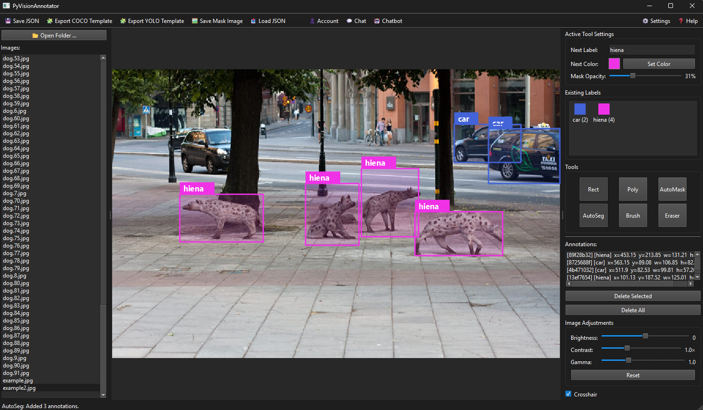
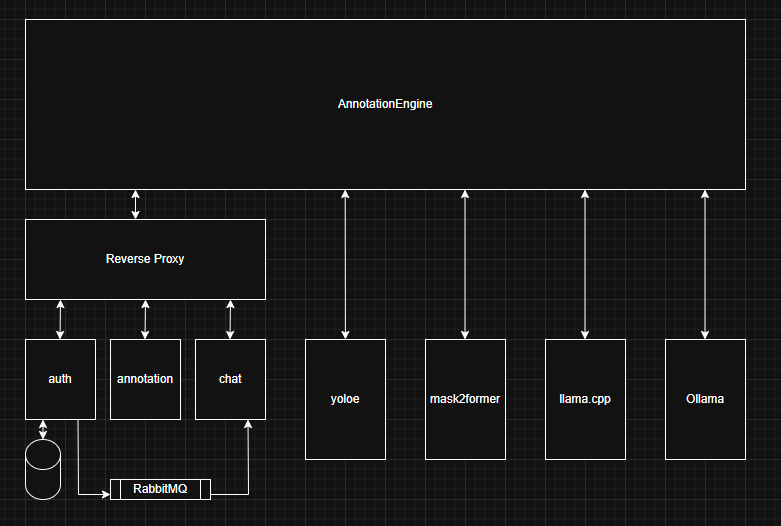

# PyVisionAnnotator

PyVisionAnnotator is a desktop image-annotation application that combines manual labeling, locally executed AI assistance, and real-time collaboration. It is intended for building and reviewing datasets used in computer-vision tasks such as object detection and image segmentation.

The project was developed as a graduation project at the Technical University of Cluj-Napoca. Its design follows a **human-in-the-loop** workflow: AI creates editable starting suggestions, while the user remains in control of validating, adjusting, and exporting the final annotations.

## Application preview



The main window provides image-folder navigation on the left, an interactive annotation canvas in the center, and tools, annotation properties, existing labels, and visual controls on the right.

## System architecture



The application is divided into three independent areas:

- **AnnotationEngine** is the PyQt6 desktop client. It manages the canvas, annotation editing, import/export, local AI workers, authentication, chat, and collaboration UI.
- **ColaborativeServer** is the Dockerized Spring Boot backend. It provides authentication, chat, collaboration sessions, and live synchronization.
- **Research** contains experiments, model integration scripts, and benchmark material for computer-vision models.

```text
User
  │
  ▼
PyQt6 desktop client (AnnotationEngine)
  ├── Manual tools: rectangles, polygons, masks, brush, eraser
  ├── Local AI workers: AutoSeg, AutoMask, local LLM assistant
  ├── Import/export: JSON, COCO template, YOLO template
  └── HTTP + WebSocket/STOMP
           │
           ▼
    Traefik reverse proxy (ColaborativeServer)
      ├── Auth service + PostgreSQL + JWT
      ├── Chat service
      ├── Annotation service (sessions and live state)
      └── RabbitMQ (inter-service events)
```

## Features

### Annotation workflow

- Load image folders containing JPG, PNG, BMP, TIFF, or WEBP files.
- Navigate precisely with zoom, pan, crosshair, brightness, contrast, and gamma controls.
- Create and edit bounding boxes, polygons, and masks.
- Use brush and eraser tools to refine mask annotations.
- Change the selected annotation's label and color; reuse existing labels quickly.
- Receive a save confirmation before changing an image or closing with unsaved work.

### Import, persistence, and export

- Save and load the application's annotation format as JSON.
- Automatically locate the associated image when a saved JSON annotation file is opened.
- Store masks compactly with a compressed bitset representation, while retaining support for legacy data.
- Export dataset templates for COCO and YOLO.
- Save a rendered image with the current masks and annotations.

### AI-assisted annotation

- **AutoSeg (YOLO):** runs a configurable external YOLO-based executable/script over the full image and imports detections as editable bounding boxes and polygons.
- **AutoMask:** runs a configurable segmentation executable/script from a point prompt, or over the complete image, and imports editable masks.
- AI work is performed asynchronously, with progress feedback, cancellation, configurable timeout, device, confidence, and model paths.
- **Local assistant:** provides an in-application chatbot through Ollama or `llama.cpp`, allowing assistance without a cloud dependency.

### Real-time collaboration

- Register and log in directly from the desktop client.
- Use JWT-protected REST endpoints for authentication and session bootstrap.
- Create or join collaborative annotation sessions.
- Synchronize annotation create, update, and delete events live through WebSocket/STOMP.
- Send large mask payloads in ordered chunks to keep real-time synchronization reliable.
- Use private chat, user presence, and message history in the collaborative mode.

> The annotation service intentionally keeps collaborative session state in memory. It is appropriate for the current MVP/research workflow; a server restart clears active collaboration state.

## Repository layout

```text
.
├── AnnotationEngine/            # Python/PyQt6 desktop application
│   ├── app.py                   # Application entry point
│   ├── core/                    # Annotation model, workers, networking
│   ├── ui/                      # Main window, canvas, panels, dialogs
│   ├── utils/                   # I/O, geometry, collaboration/UI helpers
│   └── requirements.txt         # Python dependencies
├── ColaborativeServer/          # Spring Boot services and Docker setup
│   ├── auth_module/             # Users, JWT, PostgreSQL-backed auth
│   ├── chat_module/             # Chat and presence service
│   ├── annotation_module/       # Collaboration sessions and annotation sync
│   ├── reverse_proxy/           # Traefik routing configuration
│   └── docker-compose.yml       # Backend orchestration
├── Research/                    # Model experiments, benchmarks, packaging scripts
└── Others/figs/                 # Project figures and UI/flow diagrams
```

## Requirements

### Desktop client

- Python 3.x
- PyQt6
- `websocket-client`
- `ollama` (optional, for the Ollama chatbot backend)
- `llama-cpp-python` (optional, for the local `llama.cpp` backend)

AI model scripts/executables and model weights are configured separately in the application's Settings dialog. A CUDA-capable NVIDIA GPU is recommended when the selected external models support CUDA, but the application itself can run without one.

### Collaborative backend

- Docker Desktop with Docker Compose
- Ports `80`, `5432`, `5672`, `8081`, and `15672` available on the host

The backend uses Traefik, RabbitMQ, PostgreSQL, and three Spring Boot services. Before starting it, create `ColaborativeServer/.env` with at least the variables used by `docker-compose.yml`:

```env
POSTGRES_USER=change_me
POSTGRES_PASSWORD=change_me
RABBITMQ_USERNAME=change_me
RABBITMQ_PASSWORD=change_me
AUTH_SERVICE_PORT=8080
JWT_SECRET=replace_with_a_long_random_secret
```

Keep real credentials and JWT secrets out of version control.

## Run from source

```powershell
Set-Location AnnotationEngine
python -m venv .venv
.venv\Scripts\Activate.ps1
python -m pip install -r requirements.txt
python app.py
```

The local annotation tools work without the backend. Configure AutoSeg, AutoMask, authentication endpoints, and optional local-LLM settings from the Settings dialog when you want to use those integrations.

## Start collaboration services

```powershell
Set-Location ColaborativeServer
docker compose up --build
```

After startup, the desktop client uses `http://localhost` by default. The reverse proxy routes:

| Route | Purpose |
| --- | --- |
| `/auth` | Registration, login, and JWT validation |
| `/chat`, `/notifications`, `/ws` | Chat, presence, and WebSocket communication |
| `/annotation` | Collaborative sessions, media, and annotation synchronization |

## Build a Windows package

The project includes a PyInstaller build helper:

```powershell
Set-Location AnnotationEngine
python utils/build_exe.py
```

The resulting application is placed under `AnnotationEngine/build_output/PyVisionAnnotator/`. If `Research/others/dist` contains packaged inference backends, the build helper copies them into the distribution and the application attempts to discover suitable AutoMask, AutoSeg, and YOLO weights on its first launch.

## Figures

Additional project diagrams and screenshots are available in [Others/figs](Others/figs), including AI annotation flows, the settings window, the collaboration/chat interface, and canvas event diagrams.

## License

No license file is currently included. Add an explicit license before redistributing or accepting external contributions.
