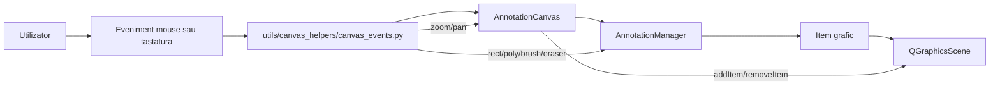
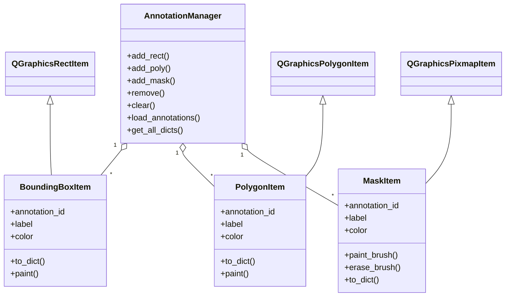
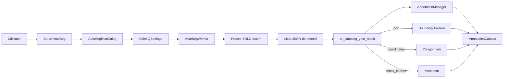

# Diagrame capitolul 5

Acest fisier contine cod Mermaid pentru diagramele recomandate in sectiunea 5.2. Diagramele pot fi randate si exportate ca imagini, apoi introduse in LaTeX in locul placeholderelor.

## Figura 5.6 - Fluxul de evenimente in canvas



## Figura 5.7 - Clasele principale pentru adnotari



## Figura 5.8 - Fluxul AutoSeg YOLO in client



## Figura 5.9 - Fluxul AutoMask pe baza unui punct selectat

```mermaid
flowchart LR
    User[Utilizator] --> Tool[Selectare AutoMask]
    Tool --> Click[Click in canvas]
    Click --> Signal[autoseg_requested]
    Signal --> Worker[AutoMaskWorker]
    Worker --> Process[Proces extern Mask2Former sau segmentare]
    Process --> Json[Obiect JSON cu coordinates]
    Json --> Handler[on_autoseg_result]
    Handler --> Canvas[AnnotationCanvas]
    Canvas --> Manager[AnnotationManager]
    Manager --> Mask[MaskItem]
    Mask --> Scene[QGraphicsScene]
```



## Figura 5.12 - Fluxul de incarcare imagine si protectia modificarilor nesalvate

```mermaid
flowchart TD
    Select[Selectare imagine noua] --> Check{_unsaved_changes?}
    Check -->|Nu| Load[Incarcare imagine in canvas]
    Check -->|Da| Prompt[Dialog Save / Discard / Cancel]

    Prompt -->|Save| SaveJson[ToolbarPanel.save_json()]
    SaveJson -->|Succes| Confirm[LeftPanel.confirm_switch()]
    SaveJson -->|Esec sau anulare| Cancel[LeftPanel.cancel_switch()]

    Prompt -->|Discard| Load
    Prompt -->|Cancel| Cancel
    Confirm --> Load
    Load --> Canvas[AnnotationCanvas.load_image()]
    Canvas --> Manager[AnnotationManager.clear()]
    Canvas --> Status[Status bar actualizat]
```
