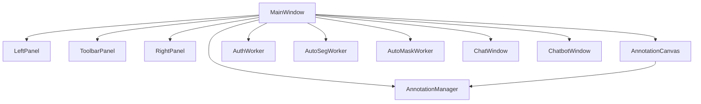
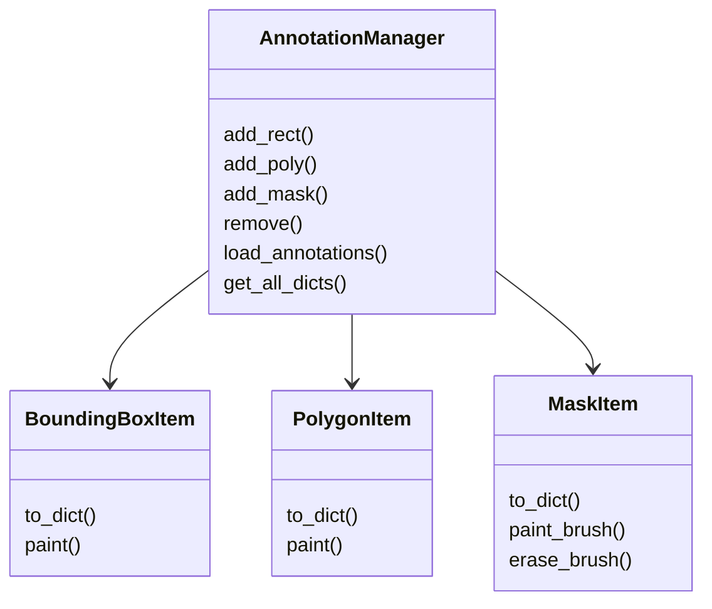
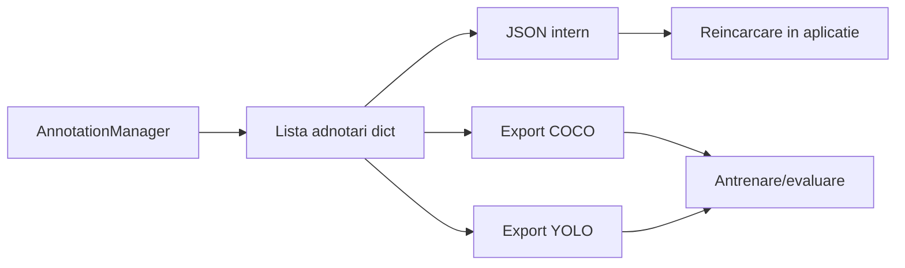
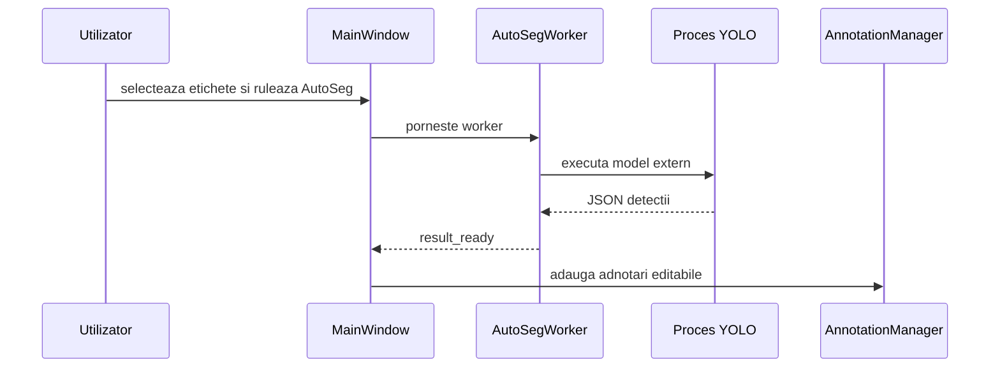
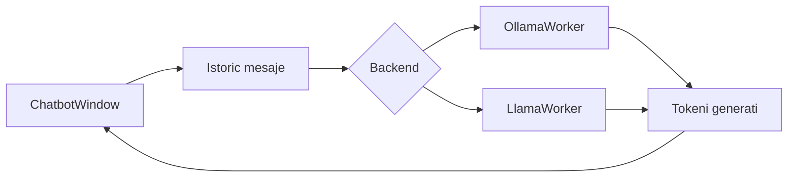
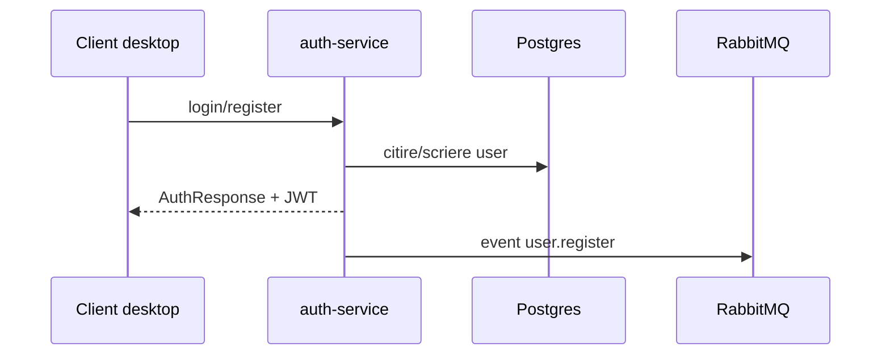
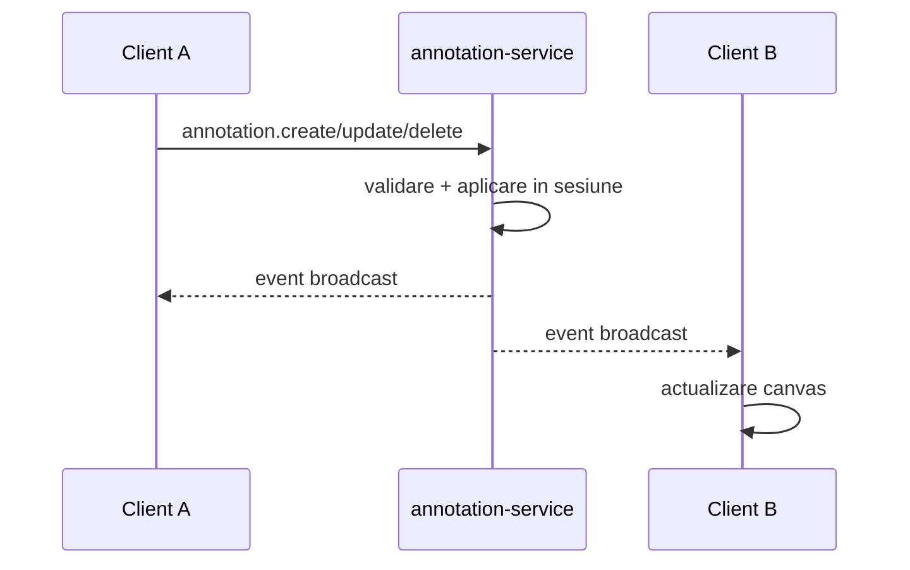
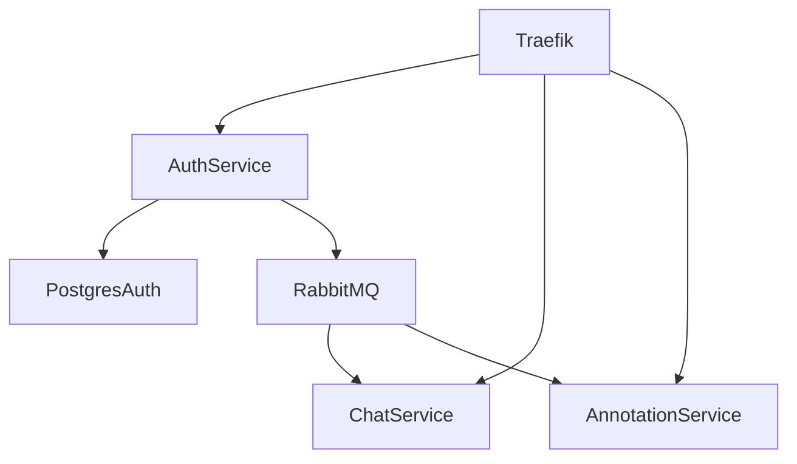
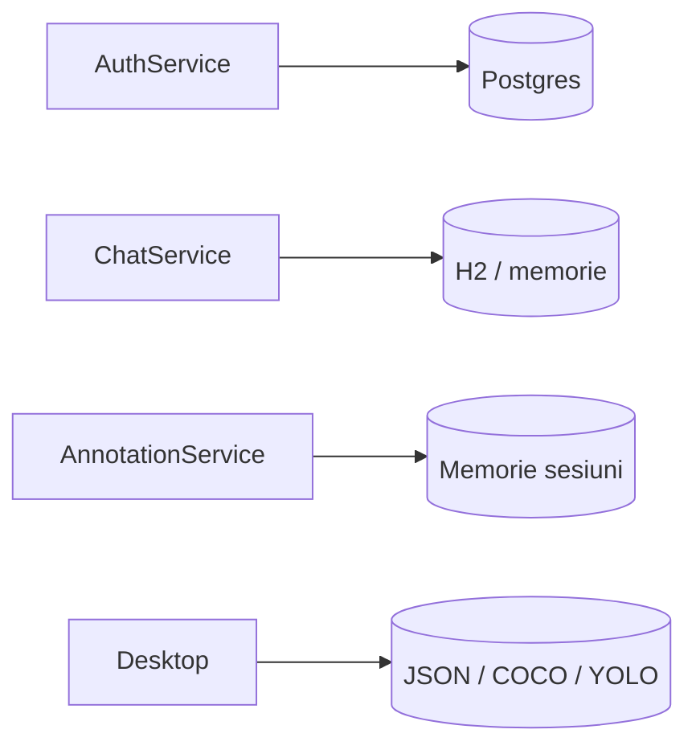

# Plan capitol 5: Proiectare de detaliu si implementare

Obiectiv: capitol de aproximativ 20 de pagini, orientat pe proiectul implementat. Capitolul trebuie sa explice cum este construit sistemul, ce componente are, cum comunica intre ele si cum sunt organizate datele si fluxurile principale. Spre deosebire de capitolul de analiza, aici se pot mentiona module, clase, fisiere, servicii si decizii concrete de implementare.

Recomandare generala: capitolul sa porneasca de la imaginea de ansamblu a proiectului, apoi sa coboare treptat spre clientul desktop, worker-e, backend, persistenta, export si deployment.

## 5.1. Arhitectura generala a sistemului

Tinta: 2-3 pagini.

Rolul sectiunii este sa ofere cititorului harta completa a proiectului inainte de detaliile pe module.

Continut recomandat:

- explica faptul ca sistemul este compus dintr-un client desktop PyQt si un backend impartit in servicii;
- prezinta cele trei zone mari:
  - `AnnotationEngine`: aplicatia desktop de adnotare;
  - `ColaborativeServer`: servicii Spring Boot pentru auth, chat si annotation;
- explica de ce exista separarea intre client, modele externe si backend;
- mentioneaza ca modelele AI nu sunt integrate direct in UI, ci apelate prin worker-e/procese externe;
- explica pe scurt infrastructura: Docker, Traefik, RabbitMQ, Postgres.

Figura principala recomandata: **Figura 5.1 - Arhitectura generala a aplicatiei**

Poza ar trebui sa arate tot proiectul legat:

Varianta pentru LaTeX:

```latex
\begin{figure}[ht]
    \centering
    \includegraphics[width=\textwidth]{figs/cap5/system_overview.png}
    \caption{Arhitectura generala a aplicatiei}
    \label{fig:system-overview}
\end{figure}
```

Observatie: creeaza un folder `figs/cap5/` si pune acolo diagramele si screenshoturile capitolului 5.

## 5.2. Structura clientului desktop PyQt

Tinta: 3-4 pagini.

Scop: explica implementarea aplicatiei desktop, fara sa repeti teoria despre PyQt din capitolul 4.

Continut recomandat:

- descrie rolul clasei `MainWindow` ca orchestrator al ferestrei principale;
- explica impartirea UI-ului:
  - `LeftPanel`: navigarea prin imagini/folder;
  - `AnnotationCanvas`: zona de desen si interactiune cu imaginea;
  - `RightPanel`: proprietati, tool-uri, setari vizuale;
  - `ToolbarPanel`: actiuni generale, salvare/export, auth, chat, chatbot;
- explica de ce UI-ul este impartit in panouri: claritate, separarea responsabilitatilor, extensibilitate;
- descrie mecanismul Qt signals/slots:
  - panourile emit evenimente;
  - `MainWindow` le conecteaza la manager, canvas sau worker-e;
  - rezultatul este un flux reactiv, fara apeluri circulare inutile.

Clase/fisiere de mentionat:

- `ui/main_window/main_window.py`
- `ui/main_window/canvas.py`
- `ui/main_window/panels/left_panel.py`
- `ui/main_window/panels/right_panel.py`
- `ui/main_window/panels/toolbar_panel.py`
- `core/annotation/annotation_manager.py`

Figuri recomandate:

1. **Figura 5.2 - Interfata principala a aplicatiei**
   - screenshot cu aplicatia deschisa, imagine incarcata si cateva adnotari;
   - caption: `Interfata principala PyVisionAnnotator: panoul de imagini, canvasul si panoul de proprietati`.

2. **Figura 5.3 - Structura logica a clientului desktop**
   - diagrama cu `MainWindow` in centru si legaturi catre panouri, canvas, manager si worker-e.

Exemplu diagrama:



Ce sa eviti:

- sa explici generic ce este Qt;
- sa repeti lista exacta de panouri din capitolul 4;
- sa intri in fiecare metoda mica.

## 5.3. Modelul intern de adnotare si randare

Tinta: 3 pagini.

Scop: arata cum sunt reprezentate concret adnotarile in aplicatie.

Continut recomandat:

- explica `AnnotationManager` ca punct central pentru adnotarile incarcate;
- descrie cele trei tipuri principale:
  - `BoundingBoxItem`;
  - `PolygonItem`;
  - `MaskItem`;
- explica faptul ca toate au conversie catre dictionar/JSON;
- explica legatura dintre obiectele grafice Qt si datele serializabile;
- descrie pe scurt editarea:
  - selectie;
  - stergere;
  - modificare eticheta/culoare;
  - brush pentru masti;
  - opacitate masca;
- explica optimizarea mastilor:
  - mastile pot avea foarte multe puncte;
  - aplicatia foloseste reprezentari compacte;
  - randarea trebuie sa ramana fluida.

Clase/fisiere de mentionat:

- `core/annotation/annotation_manager.py`
- `core/annotation/bounding_box_item.py`
- `core/annotation/polygon_item.py`
- `core/annotation/mask_item.py`
- `utils/geometry.py`
- `utils/io_handler.py`

Figuri recomandate:

1. **Figura 5.4 - Modelul de clase pentru adnotari**
   - diagrama de clase simplificata.



2. **Figura 5.5 - Exemplu de adnotari pe imagine**
   - screenshot cu dreptunghi, poligon si masca pe aceeasi imagine.

## 5.4. Salvare, incarcare si export dataset

Tinta: 2 pagini.

Scop: explica modul in care datele produse de aplicatie pot fi persistate si reutilizate.

Continut recomandat:

- explica formatul intern JSON:
  - imagine;
  - dimensiuni;
  - lista de adnotari;
  - tipuri geometrice;
- descrie `Smart Load`: la incarcarea unui JSON, aplicatia gaseste imaginea aferenta;
- explica exporturile:
  - JSON intern pentru reeditare;
  - COCO pentru dataset-uri standard;
  - YOLO pentru antrenare in fluxuri YOLO;
- explica structura pe foldere pentru rectangle/poly/mask;
- mentioneaza ca exportul este responsabilitatea clientului desktop, nu a serverului colaborativ.

Fisiere de mentionat:

- `utils/io_handler.py`
- `AnnotationEngine/feauters of the application.md`

Figuri recomandate:

1. **Figura 5.6 - Fluxul de salvare si export**



2. **Figura 5.7 - Structura folderelor exportate**
   - screenshot din Explorer cu folderele generate dupa export.

## 5.5. Integrarea AutoSeg si AutoMask

Tinta: 2-3 pagini.

Scop: explica implementarea legaturii dintre UI si modelele externe, nu teoria YOLO/Mask2Former.

Continut recomandat:

- descrie de ce modelele sunt apelate ca procese externe:
  - flexibilitate;
  - izolare;
  - posibilitatea folosirii executabilelor sau scripturilor;
- explica `SubprocessHandler`:
  - construieste comanda;
  - ruleaza fara `shell`;
  - citeste stdout;
  - parseaza JSON;
  - gestioneaza timeout/cancel;
- explica `AutoSegWorker`:
  - primeste imagine, etichete, prag, device, mod;
  - returneaza detectii;
  - rezultatele devin bbox/poligon/masca;
- explica `AutoMaskWorker`:
  - primeste imagine si punct sau mod `all`;
  - returneaza masca/masci;
  - rezultatul devine adnotare editabila;
- explica legatura cu `MainWindow` si `AnnotationManager`.

Fisiere de mentionat:

- `core/subprocess_handler.py`
- `core/workers/autoseg_worker.py`
- `core/workers/automask_worker.py`
- `utils/main_window_parts/autoseg_yolo_handlers.py`
- `utils/main_window_parts/automask_handlers.py`

Figuri recomandate:

1. **Figura 5.8 - Flux AutoSeg**



2. **Figura 5.9 - Dialog/rezultat AutoSeg sau AutoMask**
   - screenshot cu dialogul AutoSeg sau rezultat masca pe imagine.

## 5.6. Chatbot local: llama.cpp si Ollama

Tinta: 1.5-2 pagini.

Scop: arata cum este implementat asistentul local, fara sa repeti teoria LLM.

Continut recomandat:

- descrie fereastra `ChatbotWindow`;
- explica selectia backend-ului:
  - Ollama: model selectat din lista locală;
  - llama.cpp: model GGUF ales din fisier local;
- explica istoricul conversatiei:
  - system message;
  - user messages;
  - assistant messages;
- explica streaming-ul tokenilor:
  - raspunsul apare incremental;
  - UI-ul ramane responsiv;
- explica setarile llama.cpp:
  - context;
  - max tokens;
  - temperature;
  - top-p;
  - repeat penalty.

Fisiere de mentionat:

- `ui/chatbot/chatbot_window.py`
- `core/workers/ollama_worker.py`
- `core/workers/llama_worker.py`
- `ui/chatbot/prompt.py`
- `ui/chatbot/llama_params_dialog.py`

Figuri recomandate:

1. **Figura 5.10 - Fereastra chatbot local**
   - screenshot cu conversatie in aplicatie.

2. **Figura 5.11 - Fluxul de generare LLM local**



## 5.7. Autentificare si model de acces

Tinta: 2 pagini.

Scop: explica implementarea login/register/JWT si legatura cu restul sistemului.

Continut recomandat:

- descrie serviciul `auth-service`;
- explica endpointurile:
  - login;
  - register;
  - validate;
  - logout;
- explica folosirea JWT:
  - emis la login;
  - trimis in requesturi;
  - folosit pentru REST si WebSocket;
- explica salvarea conturilor in Postgres;
- explica publicarea evenimentului de register in RabbitMQ.

Fisiere de mentionat:

- `auth_module/src/main/java/.../AuthenticationController.java`
- `auth_module/src/main/java/.../UserService.java`
- `auth_module/src/main/java/.../JWTUtils.java`
- `auth_module/src/main/resources/application.properties`

Figuri recomandate:

1. **Figura 5.12 - Flux autentificare JWT**



2. **Figura 5.13 - Structura tokenului JWT**
   - daca ai pus deja figura in capitolul 4, nu o repeta aici; poti doar face referire la figura din capitolul anterior.

## 5.8. Chat si colaborare in timp real

Tinta: 3-4 pagini.

Scop: explica modul in care utilizatorii colaboreaza si comunica.

Continut recomandat:

- separa clar chatul de colaborarea pe adnotari:
  - chat: mesaje private intre utilizatori;
  - collaboration: sesiuni, imagini, adnotari, prezenta;
- descrie `ChatWindow` ca UI care combina chat si colaborare;
- explica `ChatStompWorker`:
  - conectare WebSocket/STOMP;
  - subscribe;
  - primire mesaje;
  - erori/conectare;
- explica `CollabStompWorker`:
  - topic global;
  - topic pe sesiune;
  - trimitere evenimente de adnotare;
  - deduplicare evenimente;
- explica `CollabRestClient`:
  - listare sesiuni;
  - creare sesiune;
  - snapshot;
  - upload/download imagine temporara;
- explica debounce/chunking pentru masti mari.

Fisiere client:

- `ui/chat/chat_window.py`
- `core/workers/chat_stomp_worker.py`
- `core/chat/collab_stomp_worker.py`
- `core/chat/collab_rest.py`
- `core/chat/collab_protocol.py`

Fisiere backend:

- `chat_module/src/main/java/.../ChatController.java`
- `chat_module/src/main/java/.../ChatService.java`
- `annotation_module/src/main/java/.../SessionController.java`
- `annotation_module/src/main/java/.../CollaborationWsController.java`
- `annotation_module/src/main/java/.../CollaborationService.java`

Figuri recomandate:

1. **Figura 5.14 - Flux colaborare pe adnotari**



2. **Figura 5.15 - Screenshot fereastra Chat/Collaboration**
   - ideal cu lista de sesiuni, utilizatori si zona de mesaje.

3. **Figura 5.16 - Modelul de eveniment colaborativ**
   - diagrama simpla cu `eventId`, `type`, `sessionId`, `actorId`, `version`, `payload`.

## 5.9. Serviciile backend si infrastructura Docker

Tinta: 2-3 pagini.

Scop: explica implementarea serviciilor si rularea lor impreuna.

Continut recomandat:

- prezinta serviciile:
  - `auth-service`;
  - `chat-service`;
  - `annotation-service`;
  - `reverse-proxy`;
  - `rabbitmq`;
  - `postgres-auth`;
- explica rolul Traefik:
  - intrare unica;
  - rutare catre servicii;
  - ascunderea porturilor interne;
- explica rolul RabbitMQ:
  - evenimente intre servicii;
  - decuplarea auth/chat/annotation;
- explica rolul Postgres:
  - persistenta conturilor;
- explica ce este in-memory:
  - chat conversations;
  - colaborare annotation sessions.

Fisiere de mentionat:

- `ColaborativeServer/docker-compose.yml`
- `reverse_proxy/traefik.yml`
- `reverse_proxy/dynamic.yml`
- `auth_module/Dockerfile`
- `chat_module/Dockerfile`
- `annotation_module/Dockerfile`

Figuri recomandate:

1. **Figura 5.17 - Orchestrarea serviciilor Docker**



2. **Figura 5.18 - Screenshot Docker containers**
   - captura cu containerele pornite in Docker Desktop sau output `docker ps`.

## 5.10. Persistenta si structura datelor

Tinta: 1.5-2 pagini.

Scop: explica unde sunt tinute datele si de ce.

Continut recomandat:

- Postgres pentru utilizatori auth;
- H2/in-memory pentru chat service;
- in-memory pentru sesiuni colaborative;
- fisiere locale pentru datasetul final;
- explicarea compromisului MVP:
  - colaborarea live este temporara;
  - exportul local produce artefactele finale.

Figuri recomandate:

1. **Figura 5.19 - Model de persistenta pe componente**



2. **Figura 5.20 - Schema simplificata pentru auth**
   - entitatea `User`: id, email, password, role.

## 5.11. Ambalare si rulare

Tinta: 1 pagina.

Scop: descrie cum se ruleaza aplicatia si ce parti trebuie pornite.

Continut recomandat:

- clientul desktop se ruleaza separat;
- backend-ul se porneste cu Docker Compose;
- modelele externe pot fi configurate ca executabile/scripturi;
- Ollama trebuie sa ruleze local pentru backend-ul Ollama;
- llama.cpp necesita fisier GGUF local;
- mentioneaza setarile persistente prin QSettings pentru cai si endpointuri.

Figuri recomandate:

1. **Figura 5.21 - Setari aplicatie / configurare modele**
   - screenshot cu dialogul de setari AutoSeg/AutoMask sau Llama parameters.

## 5.12. Recomandare de distributie pe 20 pagini

| Sectiune | Pagini recomandate |
|---|---:|
| 5.1 Arhitectura generala | 2.5 |
| 5.2 Client desktop PyQt | 3 |
| 5.3 Model intern de adnotare | 3 |
| 5.4 Salvare si export | 2 |
| 5.5 AutoSeg si AutoMask | 2.5 |
| 5.6 Chatbot local | 1.5 |
| 5.7 Autentificare | 2 |
| 5.8 Chat si colaborare | 3 |
| 5.9 Backend si Docker | 2 |
| 5.10 Persistenta | 1 |
| 5.11 Rulare | 0.5 |

Total aproximativ: 23 pagini brute. Dupa editare, figuri si spatiere, poate fi ajustat la 20 pagini.

## Lista finala de figuri recomandate

Nu trebuie neaparat sa le folosesti pe toate. Pentru 20 de pagini, 10-14 figuri sunt suficiente.

Prioritare:

1. Arhitectura generala a aplicatiei.
2. Screenshot interfata principala.
3. Structura logica a clientului desktop.
4. Diagrama claselor de adnotare.
5. Exemplu imagine cu bbox, poligon si masca.
6. Flux salvare/export.
7. Flux AutoSeg.
8. Flux AutoMask sau screenshot rezultat AutoMask.
9. Screenshot chatbot local.
10. Flux JWT/auth.
11. Flux colaborare in timp real.
12. Screenshot Chat/Collaboration.
13. Orchestrare Docker.
14. Model persistenta pe componente.

## Ce sa nu repeti din capitolul 4

- Nu reexplica YOLO, Mask2Former sau Transformer teoretic.
- Nu reexplica protocoalele in abstract.
- Nu descrie generic frameworkurile.
- In capitolul 5 accentul trebuie sa fie pe: ce module ai implementat, cum sunt legate, ce clase sunt importante si cum curg datele prin aplicatie.

## Fraza de inceput recomandata pentru capitol

Acest capitol descrie proiectarea de detaliu si implementarea sistemului PyVisionAnnotator, pornind de la arhitectura generala si continuand cu modulele concrete ale clientului desktop, integrarea modelelor AI, serviciile backend, mecanismele de colaborare si modul de persistenta/export al datelor.
