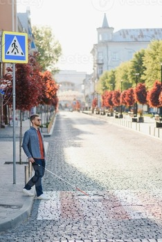
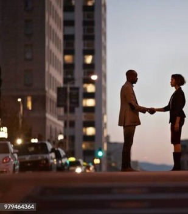
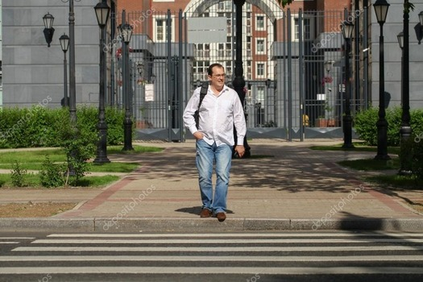
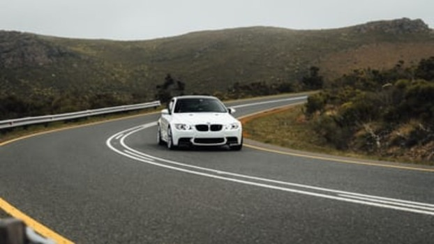
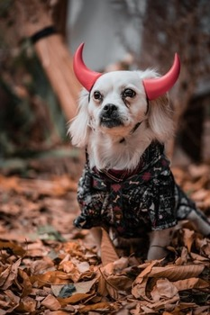

# VLM Benchmark Results

## Analysis of `sample_1.jpg`

### Response from `gemma3:12b`

* **What is happening in this image?**
A man, holding a white cane, is standing on a cobblestone street.

* **Describe the relationships between the objects.**
The man is positioned on the street between sidewalks, near a pedestrian crossing sign. Trees line both sides of the street, and a building is visible in the distance. The street appears to be wider than the sidewalks.

* **Where is the person located?**
The person is located on a cobblestone street, likely in a European city.

* **What time of day is it?**
It appears to be morning or early afternoon, based on the lighting.

* **What might happen next in the scene?**
The man may begin to cross the street, or continue walking along the sidewalk.

### Response from `qwen2.5vl:7b`

* **What is happening in this image?**
A person is walking on a cobblestone street, using a white cane with a red tip, which is a common tool for visually impaired individuals to navigate safely. The person appears to be moving forward, possibly approaching a pedestrian crossing sign.

* **Describe the relationships between the objects.**
The person is walking on the street, and the white cane is extended forward, indicating they are using it to detect obstacles or navigate. The pedestrian crossing sign is positioned on the left side of the street, and the person is moving away from it. The trees and buildings in the background suggest an urban environment.

* **Where is the person located?**
The person is located on a street in an urban area, as indicated by the presence of buildings, trees, and a pedestrian crossing sign. The cobblestone street and the style of the buildings suggest a European city.

* **What time of day is it?**
The lighting in the image suggests it is daytime, with sunlight illuminating the scene. The shadows cast by the trees and the person indicate that it is likely midday or early afternoon.

* **What might happen next in the scene?**
The person might continue walking down the street, potentially approaching the pedestrian crossing sign. They could be heading towards a destination, such as a building or a specific location, and might interact with other pedestrians or vehicles if the street is not deserted.

### Response from `llava:13b`

* **What is happening in this image?**
In the image, a man wearing a red shirt and jeans is standing on a street corner. He is looking down at the ground and appears to be using a cane or crutch for support as he walks along the sidewalk. The setting looks like a city street with buildings in the background.

* **Describe the relationships between the objects.**
The man, who is wearing a red shirt, is standing on the sidewalk next to a cane or crutch. There are several buildings in the background that provide context for the urban environment.

* **Where is the person located?**
The person is located on a city street corner.

* **What time of day is it?**
It appears to be either dawn or dusk, as the lighting suggests an early or late hour when sunlight is diffused and shadows are more pronounced.

* **What might happen next in the scene?**
In the next moments, the man could continue walking along the sidewalk, using his cane or crutch for support. Alternatively, he may cross the street if there is a pedestrian crossing available at the corner where he stands. The exact actions will depend on the man's destination and the flow of traffic in the area.

### Response from `minicpm-v:8b`

* **What is happening in this image?**
The man with a visual impairment is walking down an empty street, using his white cane and guide dog to navigate.

* **Describe the relationships between the objects.**
The pedestrian crossing sign indicates that it's safe for pedestrians to cross. The red trees line both sides of the road, creating symmetry in the scene. The person with a visual impairment is walking alongside these elements, indicating an urban setting designed for accessibility and pedestrian safety.

* **Where is the person located?**
The man is on the left side of the street near the curb, using his guide dog to navigate through this empty area.

* **What time of day is it?**
It appears to be daytime with bright sunlight casting shadows on the ground.

### Response from `llama3.2-vision:11b`

* **What is happening in this image?**
A man with a visual impairment is using a white cane to navigate a street.

* **Describe the relationships between the objects.**
The man is standing on the sidewalk, holding the white cane in his right hand. The white cane is extended in front of him, and it appears to be touching the ground.

* **Where is the person located?**
The man is located on a street in an urban area.

* **What time of day is it?**
It appears to be daytime, as there is sunlight illuminating the scene.

## Analysis of `sample_2.jpg`

### Response from `gemma3:12b`

* **What is happening in this image?**
Two people are shaking hands on a street.

* **Describe the relationships between the objects.**
The people are centered in the foreground, with cars and traffic lights in the background. The buildings form a backdrop behind the street. The people are facing each other, connected through the handshake.

* **Where is the person located?**
The people are located on a street, likely in an urban area.

* **What time of day is it?**
It appears to be dusk or early evening, judging by the fading light and illuminated buildings.

* **What might happen next in the scene?**
They might part ways, continue a conversation, or one person might lead the other somewhere.

### Response from `qwen2.5vl:7b`

* **What is happening in this image?**
Two individuals are shaking hands in an urban setting, likely indicating a business or formal agreement.

* **Describe the relationships between the objects.**
The objects in the image include two people shaking hands, a cityscape with buildings, a street with cars, and a traffic light. The people are the main focus, with the urban environment serving as the backdrop.

* **Where is the person located?**
The person is located in an urban environment, likely a city street, as indicated by the buildings, cars, and traffic light.

* **What time of day is it?**
The time of day appears to be dusk, as the sky is dim and the streetlights are on, but the sky still has some light.

* **What might happen next in the scene?**
After the handshake, the individuals might continue their conversation, walk away, or proceed to their next destination. The scene could also transition to a different activity, such as entering a building or getting into a vehicle.

### Response from `llava:13b`

* **What is happening in this image?**
In this image, a man and a woman are shaking hands with each other at night on a city street. The man appears to be offering or exchanging something to the woman. They are both standing on a sidewalk near a crosswalk.

* **Describe the relationships between the objects.**
In this image, we can observe several relationships between different objects: - A human interaction, specifically between two individuals shaking hands; - The man and woman are positioned relatively to each other, with their hands connected through a handshake; - They stand on the sidewalk next to a crosswalk, which suggests a typical urban setting with pedestrian infrastructure.

* **Where is the person located?**
The person in the image is located on a city street at night, standing on a sidewalk near a crosswalk. This indicates an urban environment during evening or nighttime hours.

* **What time of day is it?**
It is nighttime based on the illuminated surroundings and the darkness in the sky. The exact hour cannot be determined from this single image, but it's clear that we are observing a scene at night.

* **What might happen next in the scene?**
Given that both individuals are engaging in a handshake, it is likely that they have just completed a transaction, exchange of information, or conclusion to a conversation. The exact nature of their interaction cannot be determined from the image alone, but it appears to be amicable and professional. After the handshake concludes, both individuals might continue on their separate ways or perhaps engage in further discussion if needed.

### Response from `minicpm-v:8b`

* **What is happening in this image?**
Two individuals are shaking hands on a city street at dusk.

* **Describe the relationships between the objects.**
The two people standing opposite each other have their arms extended towards one another, engaged in a handshake. In the background, vehicles and buildings indicate an urban environment with active traffic flow.

* **Where is the person located?**
One individual stands on what appears to be a pedestrian crossing or median of a city street, while the other person faces them from across the road.

* **What time of day is it?**
Based on the lighting and position of shadows, it seems like evening during sunset or twilight hours.

* **What might happen next in the scene?**
The handshake may signify an agreement reached between the two individuals, potentially marking a conclusion to their discussion or meeting for that moment.

### Response from `llama3.2-vision:11b`

* **What is happening in this image?**
A man and woman are shaking hands on a city street at dusk.

* **Describe the relationships between the objects.**
The man and woman are facing each other, with their arms extended to shake hands. The city street is visible in the background, with a car driving by and a building in the distance.

* **Where is the person located?**
The man and woman are standing on a city street, likely in a business district or downtown area.

* **What time of day is it?**
It appears to be dusk, as the sky is a light gray color and the streetlights are on.

## Analysis of `sample_3.jpg`

### Response from `gemma3:12b`

* **What is happening in this image?**
A man is walking across a crosswalk.

* **Describe the relationships between the objects.**
The man is walking on a paved walkway that intersects with a crosswalk. Trees, hedges, and lampposts line the walkway. A gate and building are in the background.

* **Where is the person located?**
The person is located on a crosswalk, likely near a street or park entrance.

* **What time of day is it?**
It appears to be daytime, likely mid-morning or mid-afternoon based on the lighting.

* **What might happen next in the scene?**
The man might continue crossing the street or enter the gate/building in the background.

### Response from `qwen2.5vl:7b`

* **What is happening in this image?**
A person is walking on a pedestrian path in an urban setting.

* **Describe the relationships between the objects.**
The person is walking on a paved path with a zebra crossing in the foreground. There are lampposts lining the path, and a large gate and building are in the background. The person is carrying a backpack and appears to be in motion.

* **Where is the person located?**
The person is located on a pedestrian path in an urban area, likely a city or town, given the architecture and the presence of a gate and building in the background.

* **What time of day is it?**
The image appears to be taken during the daytime, as indicated by the shadows and the brightness of the scene.

* **What might happen next in the scene?**
The person might continue walking across the pedestrian path, potentially crossing the zebra crossing. They might stop, turn around, or interact with someone or something off-camera.

### Response from `llava:13b`

* **What is happening in this image?**
The image shows a man walking on a sidewalk during the daytime, likely near an official building or a public space.

* **Describe the relationships between the objects.**
In the image, there are at least two main objects: the person (a man) and the environment he is walking through. The environment includes the sidewalk, a fence, lampposts, and possibly some vegetation or buildings in the background. The relationship between these objects suggests that the man is moving from one point to another within an urban setting, likely going about his daily activities such as commuting, running errands, or enjoying leisure time outdoors.

* **Where is the person located?**
The person (a man) is walking on a sidewalk in what appears to be an urban area, possibly near a park or a government building. The exact location cannot be determined from this image alone.

* **What time of day is it?**
It is daytime as indicated by the bright lighting and visible shadows.

* **What might happen next in the scene?**
Given that we only see a snapshot of the man's activity, it is impossible to predict exactly what will happen next. However, some plausible scenarios could include him continuing his walk along the sidewalk, potentially arriving at a destination, or engaging with someone else nearby (like a friend or colleague). The image does not provide enough information to make more specific predictions about his actions or intentions beyond this immediate moment of walking.

### Response from `minicpm-v:8b`

* **What is happening in this image?**
The man appears to be crossing a pedestrian crosswalk.

* **Describe the relationships between the objects.**
The street lamps are positioned on either side, with the fence and gate providing boundaries. The trees add greenery alongside the walkway, while the building stands prominently behind it all.

* **Where is the person located?**
The man is walking across a pedestrian crosswalk in an urban setting.

* **What time of day is it?**
It seems to be daytime with clear skies and bright sunlight casting shadows on the ground.

* **What might happen next in the scene?**
After crossing, he may continue his walk towards another destination or perhaps enter the building behind him.

### Response from `llama3.2-vision:11b`

A: The image shows a man walking across a crosswalk, likely on his way to work or school.
B: The man is in the foreground, with a large building behind him. There are also streetlights and bushes on either side of the crosswalk.
C: The image was likely taken during the morning or early afternoon, as the man is wearing a backpack, which suggests he is heading to school or work.
D: The man is likely going to cross the street and continue on his way to his destination.

## Analysis of `sample_4.jpg`

### Response from `gemma3:12b`

* **What is happening in this image?**
A white car is driving on a winding road through a hilly landscape.

* **Describe the relationships between the objects.**
The car is on the road, which is situated between hills. The hills frame the car and road. The guardrail runs alongside the road.

* **Where is the person located?**
The person is inside the car, driving.

* **What time of day is it?**
It appears to be daytime, likely overcast or slightly hazy.

* **What might happen next in the scene?**
The car might continue driving around the bend in the road.

### Response from `qwen2.5vl:7b`

* **What is happening in this image?**
A person is riding a motorcycle on a winding road, following a white car. The motorcycle is positioned behind the car, and both are moving along the road.

* **Describe the relationships between the objects.**
The white car is in front of the motorcycle, indicating that the motorcycle is following the car. The road curves to the left, and both the car and the motorcycle are navigating this curve.

* **Where is the person located?**
The person is located on a motorcycle, which is on a road. The road is surrounded by hills and vegetation, suggesting a rural or mountainous area.

* **What time of day is it?**
The lighting in the image suggests it is daytime, but the exact time cannot be determined from the image alone.

* **What might happen next in the scene?**
The motorcycle might continue to follow the car as it navigates the curve in the road. The person on the motorcycle could either maintain their current speed or adjust their speed to match the car's pace. The car might slow down or speed up, and the motorcycle might need to adjust accordingly to maintain a safe distance.

### Response from `llava:13b`

* **What is happening in this image?**
In the image, there is a car driving down a road with mountainous terrain in the background. The road curves to the left and has lane markings visible on the asphalt surface.

* **Describe the relationships between the objects.**
The car is the main subject of the image, moving along the curve of the road while being surrounded by a natural environment with hills or mountains in the background. There are no other objects directly interacting with the car, but the lane markings on the road indicate its position and orientation relative to the curves ahead.

* **Where is the person located?**
The person appears to be inside the car, driving along the road as the driver or a passenger. Their location is inside the vehicle, traveling down the mountainous stretch of the highway.

* **What time of day is it?**
Based on the image's lighting and shadows, it is not possible to definitively determine the exact time of day. However, since there are no strong sun angles that suggest either dawn or dusk, it could be inferred that it might be a regular daytime period when visibility is good enough for driving.

* **What might happen next in the scene?**
The most likely event to occur next would be the car continuing along its path around the left curve of the road. Depending on the driver's speed and intentions, they may either accelerate, maintain their current speed, or slow down as they approach or round the turn. The surrounding landscape remains relatively unchanged, suggesting a calm and undisturbed journey.

### Response from `minicpm-v:8b`

* **What is happening in this image?**
The white BMW car, specifically a convertible model with its top down, is being driven on an uphill road bend.

* **Describe the relationships between the objects.**
In the foreground, we see a vehicle traveling along the curved road. Behind it are rolling hills and vegetation that appear to be part of a rural or mountainous area. The car's position suggests movement as it navigates through the turn.

* **Where is the person located?**
There isn't any visible driver in this image; therefore, no specific location can be determined for them within the scene.

* **What time of day is it?**
It appears to be daytime due to natural lighting and visibility. However, a precise time cannot be established without further context or shadows' directionality.

* **What might happen next in the scene?**
The car may continue its ascent along the road bend, possibly passing through more curves depending on how far it travels beyond what is visible within this frame.

### Response from `llama3.2-vision:11b`

The image depicts a white car driving on a winding road, with a mountainous landscape in the background.

 The car is the central object in the image.
 The road is curved and has a yellow line down the middle.
 The mountain in the background is green and rocky.
 There is no person visible in the image.

It appears to be daytime, as the sun is shining and there are no streetlights or other signs of nighttime.

 The car is driving on the road, and it is likely that the driver is navigating the curve.
 The mountain in the background is a natural feature that is not directly related to the car or the road.
 There are no other objects or people visible in the image, so it is not possible to predict what might happen next.

## Analysis of `sample_5.jpg`

### Response from `gemma3:12b`

* **What is happening in this image?**
A small dog, wearing a black and red plaid shirt and devil horns, is sitting amidst fallen leaves.

* **Describe the relationships between the objects.**
The dog is the central object, surrounded by fallen leaves that cover the ground. The shirt is worn by the dog. The devil horns are attached to the dog's head.

* **Where is the person located?**
A person's hand is partially visible, appearing to be holding the dog or nearby.

* **What time of day is it?**
It appears to be daytime, based on the lighting.

* **What might happen next in the scene?**
The person might continue to interact with the dog, or the dog might move or look at something else.

### Response from `qwen2.5vl:7b`

* **What is happening in this image?**
A dog is dressed in a devil costume, standing on a bed of fallen leaves. The dog appears to be posing for the photo.

* **Describe the relationships between the objects.**
The dog is the central object, wearing a devil costume with red horns and a black outfit. The fallen leaves are scattered around the dog, creating a natural and autumnal setting. The background is blurred, suggesting the focus is on the dog and the leaves.

* **Where is the person located?**
There is no person visible in the image. The focus is solely on the dog and the surrounding environment.

* **What time of day is it?**
The lighting in the image suggests it could be daytime, possibly late afternoon or early evening, given the softness of the light and the presence of shadows.

* **What might happen next in the scene?**
The dog might continue to pose for more photos, or someone might approach to interact with the dog. The scene could also be part of a photoshoot or a casual outdoor activity.

### Response from `llava:13b`

* **What is happening in this image?**
The image shows a small dog wearing horns on its head and possibly a costume, standing amidst fallen leaves.

* **Describe the relationships between the objects.**
In the image, there is a dog as the main subject, positioned in front of some scattered autumn leaves that are at the base of a tree trunk. The dog appears to be wearing horns and possibly a costume, adding a playful or decorative element to its appearance.

* **Where is the person located?**
The image does not provide enough context to determine the exact location where the person might be, but it suggests an outdoor setting with autumn leaves on the ground.

* **What time of day is it?**
Based on the lighting and shadows in the image, it appears to be daytime. However, without specific details or indicators like the position of the sun, it's not possible to determine the exact time of day with certainty.

* **What might happen next in the scene?**
Since this is a single-frame snapshot and does not provide any ongoing action, it is not possible to predict what will happen next in the scene. It could be that someone is about to pose the dog for a photo or let it play and move around freely among the leaves.

### Response from `minicpm-v:8b`

* **What is happening in this image?**
In this image, a small dog with white fur and large red horns appears to be wearing clothing. It seems like someone has dressed up or posed the dog for a photograph.

* **Describe the relationships between the objects.**
The relationship between the primary subject (the dog) and secondary elements is that of an animal being anthropomorphized, given human-like attributes such as dressing in clothes with horns on its head. These added accessories create a playful or humorous scene where the pet takes on characteristics beyond typical canine behavior.

* **Where is the person located?**
The person appears to be standing behind and slightly above the dog's level of view, suggesting they are likely off-camera holding up the camera for this shot.

* **What time of day is it?**
While there isn't a direct indication of the exact time of day from the image alone, given that outdoor photos with warm lighting can be taken during various times but often associated with late afternoon or early evening when sunlight has softer tones and longer shadows. However, without additional context such as shadow direction or artificial light sources visible in this photo, an accurate assessment cannot be made.

* **What might happen next in the scene?**
The owner may continue to take photos of their pet dressed up for fun, perhaps changing poses or adding more props related to a theme. Alternatively, they could move on with other activities after having captured these playful moments.

### Response from `llama3.2-vision:11b`

Image Description

 The scene features a small dog, likely a Chihuahua or similar breed, wearing a black shirt and red devil horns.
 The dog is positioned in the center of the image, surrounded by fallen brown leaves, and appears to be sitting on the ground.
 The atmosphere suggests a playful and lighthearted mood, with the dog's attire and the autumnal setting contributing to the overall tone.
 The image is likely intended to be humorous or entertaining, rather than serious or dramatic.

